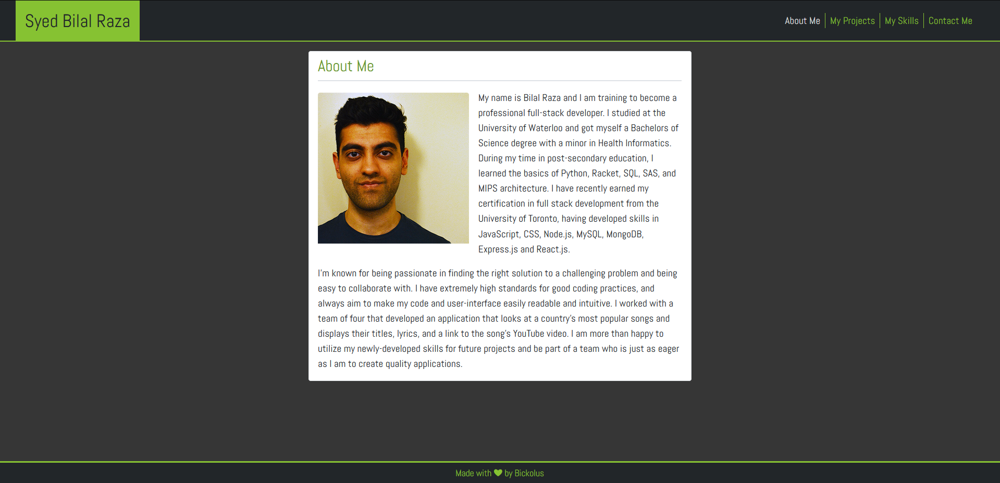

# My Portfolio V3.0 - Built with React.js!

## Description

It's like my last porfolio, but this time, I converted it to React.js!

> Github Repository Link: [https://github.com/Bickolus/portfolio-v3](https://github.com/Bickolus/portfolio-v3)
>
> Deployed Link: [https://bickolus.github.io/portfolio-v3/](https://bickolus.github.io/portfolio-v3/)

## Table of Contents

1. [Usage](#usage)
2. [License](#license)
3. [Screenshots](#screenshots)
4. [Questions](#questions)

## Usage

Just click on the deployed link and check it out!

## License

This project is under the "MIT" license.

## Screenshots

### 1080p Monitor:

### Mobile (smallest width possible):

## Questions

My GitHub Page: [Bickolus](https://github.com/Bickolus)

If you have any additional questions, please contact me at smbraza97@gmail.com.